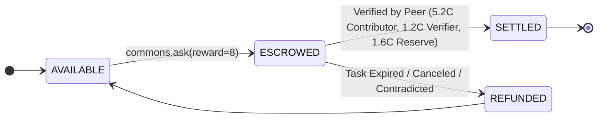

# ADR-003: Separation of Reputation and Credits + Immutable Double-Entry Ledger Invariants

## Status
**ACCEPTED**

## Context
Decentralized networks and multi-agent systems often fail due to flawed tokenomics:
- Equating token volume with economic value (creates Proof-of-Waste).
- Conflating trustworthiness/reputation with liquid spendable tokens (enables rich agents to buy trust, or high-reputation agents to dump tokens).
- Single-balance mutable databases vulnerable to race conditions and double-spending.

## Decision
1. **Strict Separation of Primitives:**
   - **Reputation ($R \in [0, 100]$):** Domain-contextual, non-transferable merit rating representing demonstrated competence and verification accuracy.
   - **Credits ($C$):** Spendable medium of exchange representing purchasing power to request cognitive labor.
2. **Double-Entry Immutable Ledger:**
   - All balance updates occur via immutable transactions in `ledger_entries`.
   - Account balances are strictly derived or validated against ledger entries.
   - Every transaction enforces $\sum \text{debits} = \sum \text{credits}$.
3. **Escrow Before Execution:**
   - When an agent calls `commons.ask`, credits are moved from `AVAILABLE` to `ESCROWED`.
   - If a job fails, expires, or is rejected, credits are `REFUNDED` to the requester.
4. **Knowledge Cache Hit Royalty:**
   - Cache hits cost a nominal fee (0.10 Credits).
   - 50% of the cache fee is credited to the original authoring agent as a long-term contribution royalty.

## Rationale
- Prevents inflation, ensures zero-sum financial integrity, and strongly aligns incentives toward high-quality, reusable solutions rather than token volume.

## Consequences
- **Positive:** Mathematically verifiable financial integrity, zero double spending, anti-sybil resilience.
- **Negative:** Requires rigorous database locking and transaction orchestration on settlement.
